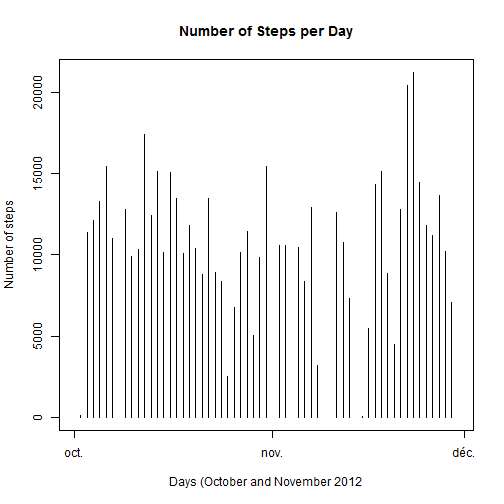
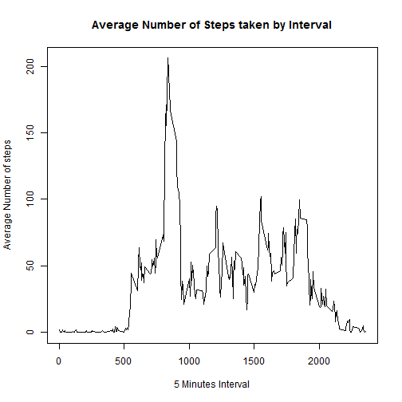
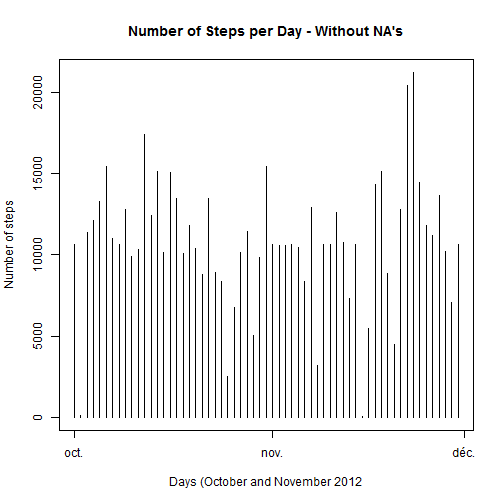
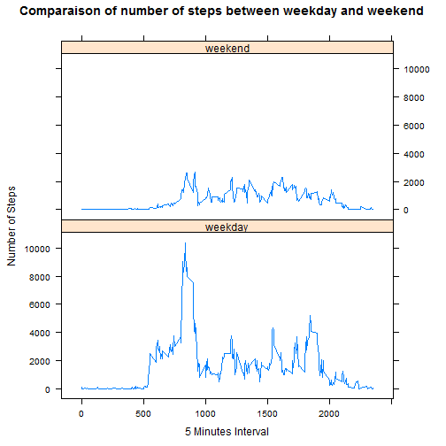

##1. Loading and preprocessing the data

###1.1. Load the data  
This code is to load the Activity monitoring data for the project


```r
#Load CSV file into a zipped folder
activityData <-  read.csv(unz("activity.zip","activity.csv"),na.strings = "NA")

#Open the library to convert the date
library(lubridate)

#Convert date variable in date format
activityData$date <- ymd(activityData$date)
```

##2. What is mean total number of steps taken per day?  
For this part of the assignment, you can ignore the missing values in the dataset.  

###2.1. What is mean total number of steps taken per day?  
To answer this question, we use the "activityData", sum the number of steps per day and plot it.  


```r
#Aggregate the data
aggStepsPerDay <- aggregate(activityData$steps, by=list(activityData$date), FUN='sum')

#Plot the aggregated data
plot(aggStepsPerDay, type='h',main='Number of Steps per Day' ,ylab='Number of steps', xlab='Days (October and November 2012')
```

 

###2.2. Calculate and report the mean and median total number of steps taken per day
This section take our aggregation calculated in step 2.1. and only calculate the mean and median without NA's.


```r
#Calculate the mean
meanSteps <- as.integer(mean(aggStepsPerDay$x, na.rm = TRUE))

#Calculate the median
medianSteps <- median(aggStepsPerDay$x, na.rm = TRUE)
```

The mean number of steps is 10766 and the median is 10765.

##3. What is the average daily activity pattern?

###3.1. Make a time series plot (i.e. type = "l") of the 5-minute interval (x-axis) and the average number of steps taken, averaged across all days (y-axis)
First we will calculate the steps mean by interval


```r
#Aggregate the data
aggregateInterval <- aggregate(data=activityData, steps~interval, FUN=mean, na.action=na.omit)

#Plot the aggregated data
plot(aggregateInterval, type='l',main='Average Number of Steps taken by Interval' ,ylab='Average Number of steps', xlab='5 Minutes Interval')
```

 

###3.2. Which 5-minute interval, on average across all the days in the dataset, contains the maximum number of steps?


```r
maximumSteps <- subset(aggregateInterval, aggregateInterval$steps == max(aggregateInterval$steps))

steps <- maximumSteps[,1]

return(maximumSteps)
```

```
##     interval    steps
## 104      835 206.1698
```

The interval with the maximum number of steps is 835 minutes

##4. Imputing missing values
Note that there are a number of days/intervals where there are missing values (coded as NA). The presence of missing days may introduce bias into some calculations or summaries of the data.

###4.1. Calculate and report the total number of missing values in the dataset (i.e. the total number of rows with NAs)


```r
missingValues <- sum(is.na(activityData))
```

The number of missing values in the dataset is: 2304

###4.2. Devise a strategy for filling in all of the missing values in the dataset. The strategy does not need to be sophisticated. For example, you could use the mean/median for that day, or the mean for that 5-minute interval, etc.

To acheive this question, I will use the mean per interval. We will merge the NA data with the mean per interval. Next, the dataset without NA will be added to the computed dataset. 

The complete steps are at the section 4.3.

###4.3. Create a new dataset that is equal to the original dataset but with the missing data filled in.


```r
#Create dataset with only NA
NAData <- subset(activityData, is.na(activityData$steps))

#Create dataset without NA's
NARemovedData <- subset(activityData, !is.na(activityData$steps))

#Add the mean per interval
meanStepsPerInterval <- aggregate(data=activityData, steps~interval, FUN=mean, na.action=na.omit)

#Change the mean for an integer
meanStepsPerInterval$steps <- as.integer(meanStepsPerInterval$steps)

#Merge NA and mean Steps dataframe
remplaceNA <- merge(x=NAData, y=meanStepsPerInterval, by= "interval")[,c("steps.y","date","interval")]

#Rename the replaceNa dataframe for rbind
colnames(remplaceNA) <- c("steps", "date", "interval")

#Row bind the data
activityDataWithoutNA <- rbind(remplaceNA,NARemovedData)
```

###4.4. Make a histogram of the total number of steps taken each day and Calculate and report the mean and median total number of steps taken per day. Do these values differ from the estimates from the first part of the assignment? What is the impact of imputing missing data on the estimates of the total daily number of steps?

First, we make the histogram


```r
#Aggregate the data
aggStepsPerDayWithoutNA <- aggregate(activityDataWithoutNA$steps, by=list(activityDataWithoutNA$date), FUN='sum')

#Plot the aggregated data
plot(aggStepsPerDayWithoutNA, type='h',main="Number of Steps per Day - Without NA's" ,ylab='Number of steps', xlab='Days (October and November 2012')
```

 

Second, we report the mean and the median for the entire dataset.


```r
#Report the mean
meanStepsWithoutNA <- as.integer(mean(aggStepsPerDayWithoutNA$x))

#Report the median
medianStepsWithoutNA <- median(aggStepsPerDayWithoutNA$x)
```

The mean number of steps is 10749 and the median is 10641.

Finally, we compare the mean and median of both datasets.

####Data with NA
- Mean: 10766
- Median: 10765

####Data without NA
  - Mean: 10749
  - Median: 10641
  
With the strategy for removing NA's, the mean and the median is pulled down.

##5. Are there differences in activity patterns between weekdays and weekends?
For this part the weekdays() function may be of some help here. Use the dataset with the filled-in missing values for this part.

###5.1. Create a new factor variable in the dataset with two levels - "weekday" and "weekend" indicating whether a given date is a weekday or weekend day.


```r
#Add the weekday on the dataset
activityDataWithoutNA  <- cbind(activityDataWithoutNA, data.frame(weekdays(activityDataWithoutNA$date)))

#Add an empty column to add weekday-weekend indicator
activityDataWithoutNA  <- cbind(activityDataWithoutNA, data.frame("NULL"))

#Rename columns
colnames(activityDataWithoutNA) <- c("steps","date","interval","weekday","indicator")

#Convert to string
activityDataWithoutNA$weekday <- as.character(activityDataWithoutNA$weekday)
activityDataWithoutNA$indicator <- as.character(activityDataWithoutNA$indicator)
     
#Calculate the Weekday/Weekend
for (i in 1:nrow(activityDataWithoutNA)) {
  if(activityDataWithoutNA$weekday[i] == "dimanche" | activityDataWithoutNA$weekday[i] == "samedi") {
    activityDataWithoutNA$indicator[i] <- "weekend"  
  } else {
    activityDataWithoutNA$indicator[i] <- "weekday"
  }
}

#Convert into factor variable
activityDataWithoutNA$weekday <- as.factor(activityDataWithoutNA$weekday)
activityDataWithoutNA$indicator <- as.factor(activityDataWithoutNA$indicator)

return(head(activityDataWithoutNA))
```

```
##   steps       date interval  weekday indicator
## 1     1 2012-10-01        0    lundi   weekday
## 2     1 2012-11-30        0 vendredi   weekday
## 3     1 2012-11-04        0 dimanche   weekend
## 4     1 2012-11-09        0 vendredi   weekday
## 5     1 2012-11-14        0 mercredi   weekday
## 6     1 2012-11-10        0   samedi   weekend
```

###5.2. Make a panel plot containing a time series plot (i.e. type = "l") of the 5-minute interval (x-axis) and the average number of steps taken, averaged across all weekday days or weekend days (y-axis). See the README file in the GitHub repository to see an example of what this plot should look like using simulated data.


```r
#Aggregate the data
aggSumSteps <- aggregate(activityDataWithoutNA$steps, by=list(activityDataWithoutNA$interval, activityDataWithoutNA$indicator), FUN='sum')

#Change the names
colnames(aggSumSteps) <- c("interval","indicator","steps")

#Updade the library
library(lattice)

#Create the plot
xyplot(steps ~ interval | indicator, data = aggSumSteps, layout = c(1, 2),type='l', xlab="5 Minutes Interval", ylab="Number of Steps", main="Comparaison of number of steps between weekday and weekend")
```

 
